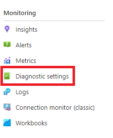
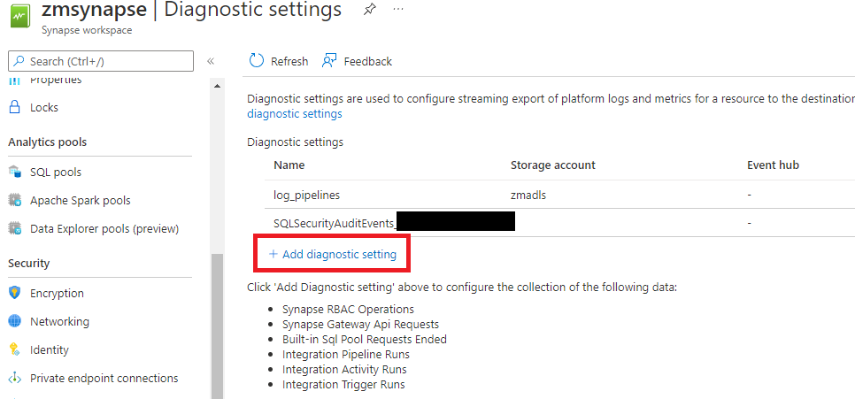
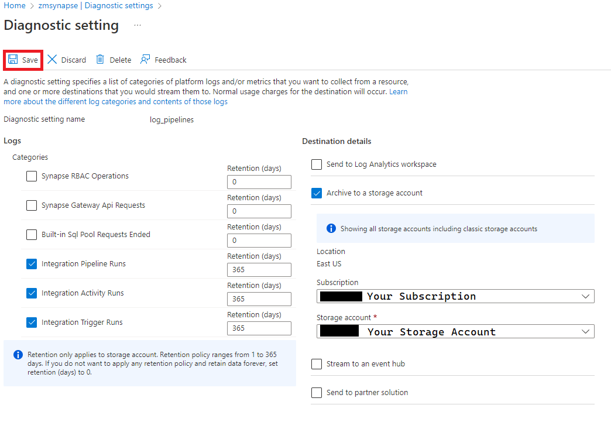

# Review Activity Runs in Synapse Serverless/ADX/Spark
This is intended to be a __starter__ script for analyzing the data coming from the Activity Runs diagnostic that can be set for Synapse Pipelines in the Azure Portal. This initial script aggregates pipeline duration including cluster warm up. It is based on this [blog](https://www.datastoics.com/posts/azure-synapse-cost-charge-back/). The only difference in this solution is that we'll be focused on cluster warm up and overall run time from the different activities. Additionally, this solution offers a Synapse Serverless script to analyze the Activity Runs.

#### _NOTE: This is an early version that will need battle tested with less "happy path" pipelines_

## Pre-Requisite Steps
1. Go to your Synapse resource in the Azure Portal.
2. Find "Diagnostic Settings" on the blade to the left. 

    

3. Click the "Add diagnostic setting" link in the main window.

    

4. Set your the diagnostic options like in the screenshot below. __NOTE: This is only for the purpose of watching Synapse Pipelines. Check with IT if there are other options set.__

    

5. Let some data accrue before moving on to querying.

## Query in Serverless
1. Ensure you have the correct access to the storage set up in step 4 of the pre-requisites.
2. Modify the [pipelineDuration](./serverless-sql/pipelineDuration.sql) script to use the name of your storage account.
3. Run the query in the Synapse Serverless Pool.

#### Example Results

#### _NOTE: There is a granularity loss in the pipelineDuration field. It is currently estimated to minutes. Seconds was citing too large of a distance between date diffs. This is something I'm researching._

